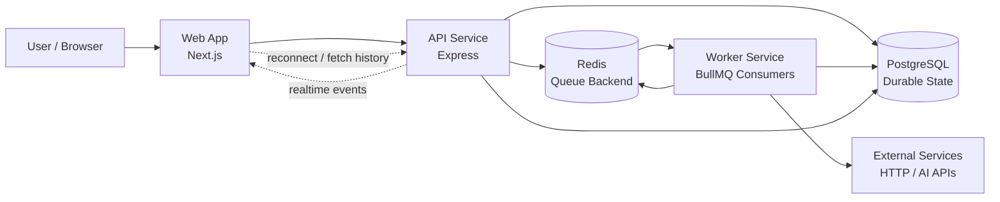

# High-Level Architecture

ExecLoom separates fast HTTP request handling from long-running workflow execution.

## System Diagram

## Request Flow

1. User starts a workflow from the web app.
2. API validates the request.
3. API creates durable execution records in PostgreSQL.
4. API enqueues a job in Redis/BullMQ.
5. API returns quickly to the frontend.
6. Worker picks up the job from Redis.
7. Worker executes workflow steps one by one.
8. Worker saves step status, outputs, errors, and events in PostgreSQL.
9. Frontend receives live updates and can rebuild history from PostgreSQL after refresh.

## Core Responsibility Split

| Component | Responsibility |
| --- | --- |
| Web App | UI for workflows, executions, and live timeline |
| API | Auth, validation, workflow CRUD, trigger execution, realtime gateway |
| PostgreSQL | Source of truth for users, workflows, executions, steps, and events |
| Redis/BullMQ | Job dispatch, delayed jobs, retries, worker coordination |
| Worker | Long-running workflow execution, retries, step processing |
| External Services | HTTP endpoints, AI APIs, future integrations |

## Interview Explanation

The API does not execute workflows directly. It validates the request, writes durable state to PostgreSQL, enqueues work, and responds quickly.

The worker handles slow and failure-prone execution work outside the request lifecycle. PostgreSQL remains the source of truth, while Redis/BullMQ is only used for dispatch and retry scheduling.
