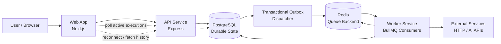

# High-Level Architecture

ExecLoom separates fast HTTP request handling from long-running workflow execution.

## System Diagram

```mermaid
flowchart LR
  User[User / Browser]
  Web[Web App<br/>Next.js]
  API[API Service<br/>Express]
  DB[(PostgreSQL<br/>Durable State)]
  Dispatcher[Transactional Outbox<br/>Dispatcher]
  Redis[(Redis<br/>Queue Backend)]
  Worker[Worker Service<br/>BullMQ Consumers]
  External[External Services<br/>HTTP / AI APIs]

  User --> Web
  Web --> API

  API --> DB
  DB --> Dispatcher
  Dispatcher --> Redis

  Redis --> Worker
  Worker --> DB
  Worker --> External
  Worker --> Redis

  Web -. poll active executions .-> API
  Web -. reconnect / fetch history .-> API
  API --> DB
```

## Request Flow

1. User starts a workflow from the web app.
2. API validates the request.
3. API creates durable execution records in PostgreSQL.
4. The same PostgreSQL transaction creates an outbox intent for the first runnable step.
5. API returns quickly to the frontend without depending on Redis availability.
6. The outbox dispatcher publishes the intent to BullMQ with a deterministic job ID.
7. Worker picks up the job from Redis and claims its step in PostgreSQL.
8. Worker executes workflow steps one by one.
9. Each step transaction saves state and creates the next outbox intent when needed.
10. Frontend polls queued or running executions and stops after a terminal status.
11. A refresh rebuilds the execution view from PostgreSQL.

## Core Responsibility Split

| Component | Responsibility |
| --- | --- |
| Web App | Visual authoring, publishing, execution history, and status polling |
| API | Auth, validation, workflow versioning, and execution triggers |
| PostgreSQL | Source of truth for users, workflows, executions, steps, and events |
| Outbox Dispatcher | Reliable publication of PostgreSQL dispatch intents to BullMQ |
| Redis/BullMQ | Job dispatch, delayed jobs, retries, worker coordination |
| Worker | Long-running workflow execution, retries, step processing |
| External Services | HTTP endpoints, AI APIs, future integrations |

## Interview Explanation

The API does not execute workflows or publish directly to Redis. It atomically writes durable execution state and an outbox intent to PostgreSQL, then responds quickly.

The dispatcher eventually publishes that intent to BullMQ, and deterministic job IDs make duplicate publication safe. The worker handles slow and failure-prone execution outside the request lifecycle. PostgreSQL remains the source of truth, while Redis/BullMQ is delivery infrastructure.
