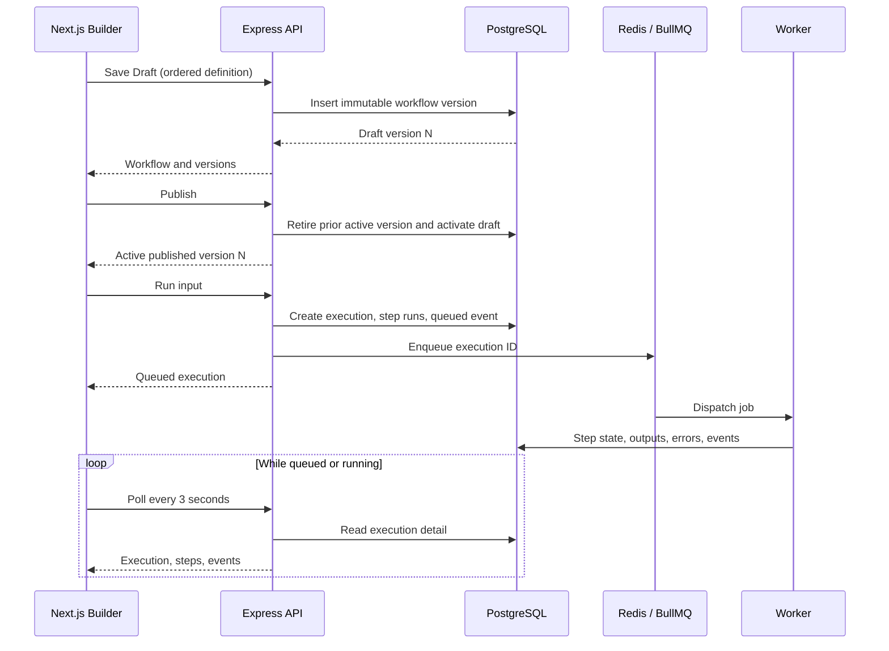

# Visual Workflow Builder Architecture

The visual builder is a frontend representation of ExecLoom's existing linear execution model. It does not introduce a second workflow format or change worker behavior.

## Why React Flow

ExecLoom uses `@xyflow/react` for canvas mechanics:

- Node rendering and connection handles
- Selection, keyboard deletion, zoom, and pan
- Drag-and-drop coordinates
- Edge rendering, controls, and minimap
- Accessible DOM-based custom nodes

Building those interactions directly would require substantial pointer, viewport, keyboard, and accessibility code before delivering workflow behavior. React Flow owns those general canvas concerns; ExecLoom still owns node types, forms, validation, persistence, and execution semantics.

## Why A Linear Chain

The worker executes `definition.steps` in array order. It does not currently schedule branches, joins, or parallel dependencies.

The editor therefore accepts exactly one chain:

```text
Start -> Step A -> Step B -> Step C
```

It rejects cycles, disconnected nodes, multiple incoming edges, and multiple outgoing edges. Rewiring changes array order; moving a node changes only its saved coordinates.

This boundary is intentional. Showing arbitrary DAG authoring before the worker can execute DAGs would create a false product contract. Branching can be added later only with explicit execution semantics for joins, failure propagation, retries, and parallel scheduling.

## Editor Data Boundary

The browser keeps the unsaved editor model in React component state:

```text
WorkflowGraph
  nodes: step definition + canvas position
  edges: visual execution order
```

The fixed Start node is visual only. It is never stored as an executable step.

On load:

1. Read the immutable version's ordered `steps` array.
2. Create one canvas node per step.
3. Restore optional `layout.positions`.
4. Derive edges from step order.

On Save Draft:

1. Validate that every node belongs to one Start chain.
2. Walk that chain to compile the ordered `steps` array.
3. Validate typed step configuration with the shared Zod contract.
4. Save positions under `definition.layout.positions`.
5. Create a new immutable `workflow_versions` row through the existing API.

Edges are not persisted because they duplicate the canonical step order. No database migration is required because the definition is already JSONB.

Unsaved workflow data is not autosaved to the server or browser storage. The editor warns before navigation and only persists after an explicit Save Draft action.

## Save, Publish, And Run



The execution detail screen loads the exact `workflowVersionId` used by the run, recreates its read-only graph, and overlays each `step_run.status` by stable step key. Polling stops automatically for `succeeded`, `failed`, or `cancelled` executions.

## Main Code Paths

| Concern | Location |
| --- | --- |
| Shared definition/layout contract | `packages/contracts/src/index.ts` |
| Graph conversion and validation | `apps/web/src/lib/workflow-graph.ts` |
| React Flow canvas and custom nodes | `apps/web/src/components/workflow-editor/` |
| Editor save/publish/run orchestration | `apps/web/src/components/workflow-editor/workflow-editor-screen.tsx` |
| Execution status overlay | `apps/web/src/components/executions/execution-detail-screen.tsx` |
| Worker ordered-step execution | `apps/worker/` and `packages/workflow-core/` |

## Interview Explanation

React Flow was selected for mature canvas interactions, not for workflow semantics. ExecLoom validates a linear chain because the current worker executes an ordered array; permitting arbitrary graphs would promise unsupported behavior. The steps array is canonical, positions are optional presentation metadata, and edges are derived. Saving creates an immutable version, publishing atomically selects the runnable version, BullMQ dispatches it, PostgreSQL stores durable execution state, and the frontend polls active runs to render status overlays.
